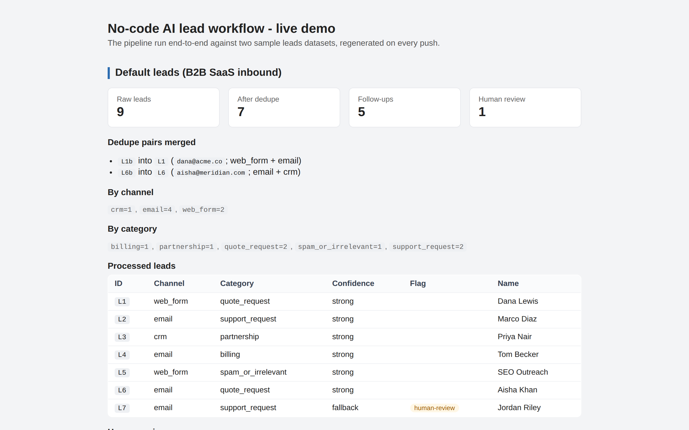
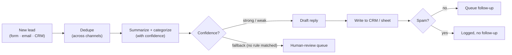

# No-code AI lead workflow

[](https://github.com/derekgallardo01/nocode-ai-lead-workflow/actions/workflows/ci.yml) [](LICENSE) [](#)

**Docs:** [Getting started](docs/getting-started.md) · [Architecture](docs/architecture.md) · [Customization](docs/customization.md) · [Evaluation](docs/evaluation.md) · [Diagrams](docs/diagrams.md) · [FAQ](docs/faq.md)

**Live demo:** [derekgallardo01.github.io/nocode-ai-lead-workflow](https://derekgallardo01.github.io/nocode-ai-lead-workflow/) — both leads datasets processed end-to-end (dedupe summary, per-category breakdown, human-review queue), regenerated on every push.

[](https://derekgallardo01.github.io/nocode-ai-lead-workflow/)

[Full-page capture (both datasets) →](docs/screenshots/01-overview-fullpage.png)


The pattern behind "AI automation" projects: a lead arrives (web form, email,
CRM) → **deduped across channels** → an LLM summarizes and categorizes it →
drafts a context-aware reply → it's written to a CRM/sheet → a follow-up is
queued, with spam filtered out and **low-confidence leads routed to a
human-review queue** instead of being mis-replied to.

Buildable in Make.com / Zapier / n8n / Power Automate — proven here as
runnable code, with a node-by-node mapping to each of those tools in
[blueprint.md](blueprint.md).

```bash
python run.py                              # 9 leads in → 7 deduped, 5 follow-ups, 1 human-review
python cli.py data/leads.json              # process any leads file
python cli.py data/leads.json --no-dedupe  # keep cross-channel duplicates
python evals/run.py                        # 11 eval cases, CI-gating
python -m pytest -q                        # 16 unit tests
```

Stdlib-only Python, no keys, no tenant required to run any of this.

## Run in Docker

```bash
docker build -t nocode-lead-workflow .
docker run --rm nocode-lead-workflow                                                  # scripted demo (default leads)
docker run --rm nocode-lead-workflow python cli.py data/leads-real-estate.json        # real-estate leads
docker run --rm nocode-lead-workflow python evals/run.py                              # 12 eval cases
docker run --rm nocode-lead-workflow python -m pytest -q                              # 16 unit tests
```

## The problem it solves

Inbound arrives from a form, a shared inbox, and a CRM, and someone reads
every message to decide whether it's a sales lead, a support issue, or noise
— then copies the good ones into the CRM by hand, often **duplicating** the
person who emailed AND filled out the form. Quotes sit for a day; support
gets lost behind spam; auto-replies go out to vague messages that needed a
human to read them first. This triages every lead in seconds, deduplicates
across channels, drafts the reply, and **flags genuinely ambiguous leads for
human review** before any reply leaves the system.



## Architecture in one paragraph

`run(leads_path, out_dir)` runs four steps: (1) `dedupe(leads)` collapses
leads sharing a normalized email and records each merged pair for audit;
(2) `process_leads` calls `_classify` (returns `category, confidence,
matched_keywords` where confidence is `strong` / `weak` / `fallback`),
summarises the message, and drafts a reply from `REPLY_TEMPLATES`; (3)
`save_crm` persists `crm.csv` + `crm.json` with all fields including
`merged_from`; (4) leads with `needs_human_review=True` (fallback confidence
OR weak spam matches) go to `for_human_review.json`, the rest go to
`follow_ups.json`. Full diagrams + per-component notes:
[docs/architecture.md](docs/architecture.md).

## Sample output

```text
=== Default run (dedupe + human-review enabled) ===
Raw leads: 9 | Deduped: 7 | Merged pairs: 2
  merged L1b into L1 (dana@acme.co; web_form + email)
  merged L6b into L6 (aisha@meridian.com; email + crm)
Follow-ups: 5 | Human review: 1

  [L1] web_form  quote_request      conf=strong   Dana Lewis
  [L2] email     support_request    conf=strong   Marco Diaz
  [L3] crm       partnership        conf=strong   Priya Nair
  [L4] email     billing            conf=strong   Tom Becker
  [L5] web_form  spam_or_irrelevant conf=strong   SEO Outreach
  [L6] email     quote_request      conf=strong   Aisha Khan
  [L7] email     support_request    conf=fallback Jordan Riley  [HUMAN-REVIEW]
```

Captured run including `crm.csv` head, `for_human_review.json`, and
`follow_ups.json` snippets: [docs/sample-run.txt](docs/sample-run.txt).

## Evaluation

Eleven cases in [evals/golden.json](evals/golden.json) cover each category,
strong vs weak vs fallback confidence, dedupe positive/negative paths, spam
suppression, and the full end-to-end sample.

```bash
$ python evals/run.py
Eval: 11/11 passed (100%)
```

How to add cases (real misrouted leads, paraphrases, adversarial keywords) is
in [docs/evaluation.md](docs/evaluation.md).

## Customization

Six typical tuning points — RULES keywords, confidence-to-human-review
threshold, swap the stub for a real LLM, reply templates, dedupe strategy
(exact email vs `+aliases` vs fuzzy on name + body), routing the
human-review queue to Slack / Teams / a CRM task — are walked through in
[docs/customization.md](docs/customization.md).

## What's inside

| Path | Purpose |
|------|---------|
| [pipeline.py](pipeline.py) | The workflow: dedupe, classify, summarize, draft, save, queue. |
| [cli.py](cli.py) | `python cli.py <leads_path> [--out DIR] [--no-dedupe] [--no-human-review]`. |
| [run.py](run.py) | Default demo: prints dedupe summary + per-lead status + human-review queue. |
| [data/leads.json](data/leads.json) | 9 sample leads (5 categories, 2 dedupe pairs across channels, 1 fallback case). |
| [data/leads-real-estate.json](data/leads-real-estate.json) | 8 real-estate-flavored sample leads (1 dedupe pair, 1 fallback case) — proves the workflow works on a different industry's inbound. |
| [blueprint.md](blueprint.md) | Node-by-node mapping onto Make.com, Zapier, n8n, and Power Automate. |
| [tests/](tests/) | 16 pytest tests including dedupe, fallback detection, no-dedupe and no-human-review modes. |
| [evals/](evals/) | 11 end-to-end eval cases + CI-gating runner. |
| [docs/](docs/) | Architecture, customization, and evaluation guides. |

## Building it for real

The default classifier/answerer is a deterministic stub so the demo runs
without keys. A real LLM plugs in behind the existing `complete()` interface
via `LLM_PROVIDER` ([docs/customization.md#3-swap-the-stub-for-a-real-llm](docs/customization.md)
has the suggested prompt). To ship it, follow [blueprint.md](blueprint.md) to
recreate the steps in the client's existing automation tool, wire their LLM
key, route the human-review queue into the channel their team actually reads
(Slack / Teams / Jira), and test on their real messages first.
