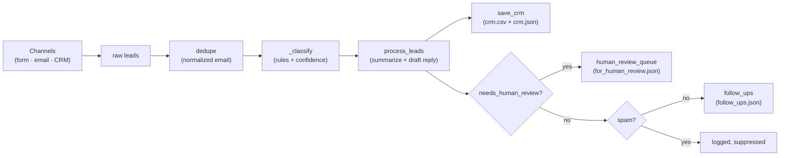
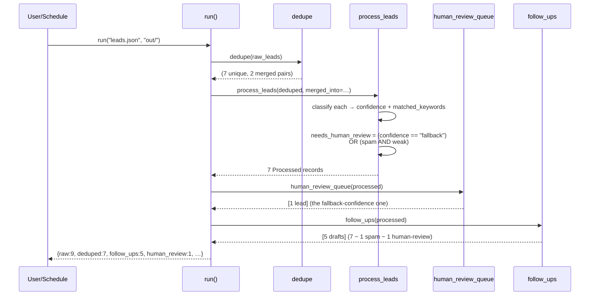

# Architecture

A small, stdlib-only pipeline that takes inbound leads (form / email / CRM)
and produces three artefacts: a CRM row per unique lead, a follow-up queue
for confidently-classified leads, and a **human-review queue** for the ones
where the rules weren't sure. The whole flow runs offline and is the
node-by-node spec for the no-code build in [blueprint.md](../blueprint.md).

## Components

| Piece | Lives in | Job |
|-------|----------|-----|
| `Lead` / `Processed` | [pipeline.py](../pipeline.py) | Dataclasses for input and processed records (incl. `confidence`, `needs_human_review`, `matched_keywords`, `merged_from`). |
| `dedupe` | [pipeline.py](../pipeline.py) | Collapses leads sharing a normalized email; returns `(deduped, pairs)` for audit. |
| `_classify` | [pipeline.py](../pipeline.py) | Returns `(category, confidence, matched_keywords)`. `confidence` is `strong` (2+ matches) / `weak` (1 match) / `fallback` (no match → default). |
| `process_leads` | [pipeline.py](../pipeline.py) | Maps each deduped lead through classify + summarize + draft + flag-for-review. |
| `complete` | [pipeline.py](../pipeline.py) | LLM seam: local stub by default; `LLM_PROVIDER=azure\|anthropic` routes to a real model. |
| `follow_ups` / `human_review_queue` | [pipeline.py](../pipeline.py) | Two queues: ready-to-send drafts vs. needs-a-human-eye. |
| `save_crm` | [pipeline.py](../pipeline.py) | Writes `crm.csv` + `crm.json` with all fields incl. matched keywords + merged_from. |
| `run` | [pipeline.py](../pipeline.py) | Glue: returns a counts-and-lists dict + writes the three output files. |
| CLI | [cli.py](../cli.py) | `python cli.py <leads_path> [--out DIR] [--no-dedupe] [--no-human-review]`. |
| Blueprint | [blueprint.md](../blueprint.md) | Node-by-node mapping onto Make.com / Zapier / n8n / Power Automate. |
| Eval harness | [evals/](../evals/) | 11 inline-leads cases covering each category, dedupe, fallback flagging, end-to-end. |

## Turn sequence — typical batch

## Why the design looks like this

- **Dedupe before classify, not after.** Classifying then deduping means you
  do twice the LLM work AND have to reconcile potentially-different categories
  for the same person. Dedupe-first is one record, one classification, one
  audit trail.
- **Confidence is captured, not thrown away.** The `confidence` field on each
  `Processed` row is what makes "route this one to a human" a defensible
  decision later. Without it, you've already auto-replied to a vague message.
- **Fallback ≠ weak.** A *weak* match (one keyword in "I need help with
  something") still goes through normal flow — the keyword landed, the
  category is right, the reply is generic enough. A *fallback* (no keyword
  matched at all) is genuinely unknown, so it goes to human review.
- **Spam suppression and human-review are different exits.** Spam doesn't get
  a follow-up AND doesn't go to human review — it's just logged. The human-
  review queue is for legitimate-looking-but-uncertain leads only.
- **`merged_from` is preserved on the kept record** so you can answer "did
  Dana fill out the form?" with `merged_from: ["L1b"]` six months later.
- **No new deps.** Same `LLM_PROVIDER` seam as the RAG kit. Build it with a
  real model when you're ready; the rule-based stub is the test harness.

## Where to look first if something goes wrong

| Symptom | Look here |
|---------|-----------|
| Wrong category | The `RULES` table in [pipeline.py](../pipeline.py). Add the missing keyword(s); add a case to [evals/golden.json](../evals/golden.json) first. |
| Missed dedup (same person, different rows in CRM) | Check `_norm_email` — it only lowercases and trims. Fuzzy match on name + body is suggested in [customization.md](customization.md). |
| Spam slipped through | The spam keyword list in `RULES`. Add the new spam phrase, add an eval case. |
| Human-review queue empty when it shouldn't be | The lead probably weakly matched some category (one keyword). Tighten the rule: change `needs_review` to also flag weak matches in `process_leads`. |
| CRM CSV missing columns | The `Processed` dataclass shape changed; `save_crm` uses `asdict` so adding a field updates the schema automatically. |
