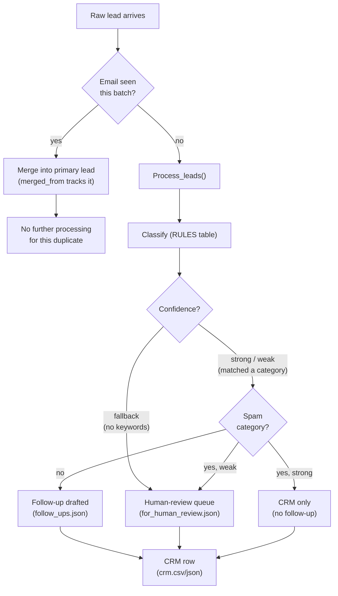
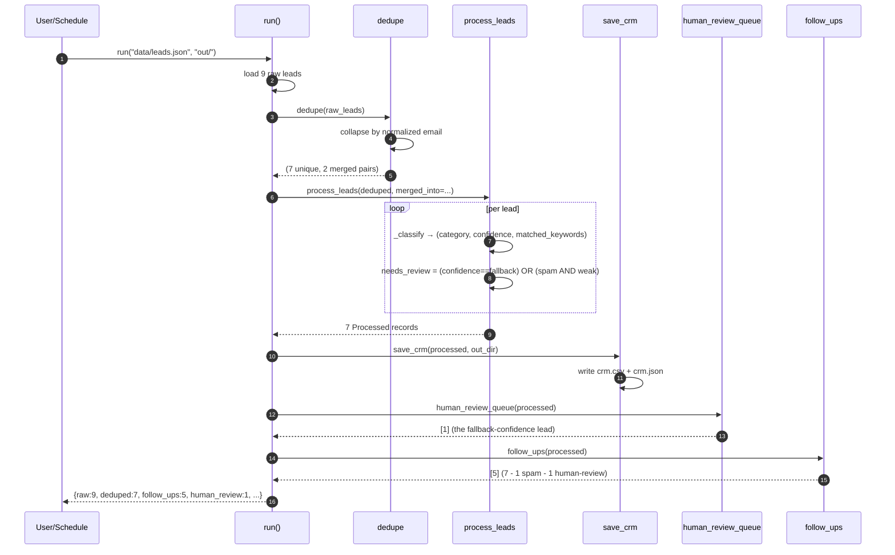
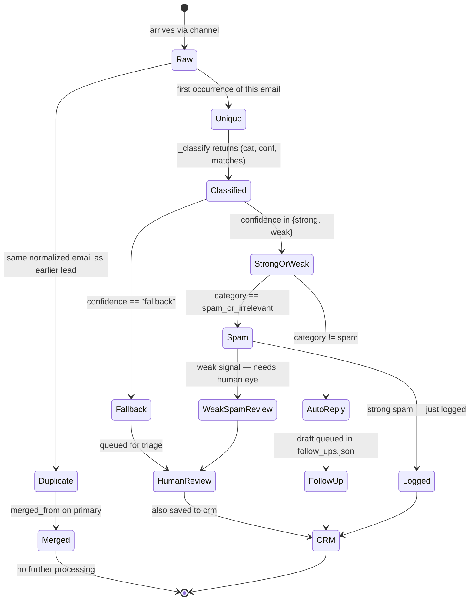
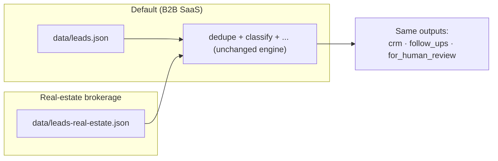

# Diagrams

Beyond the inline ones in [architecture.md](architecture.md).

## 1. Decision tree — what happens to each lead

## 2. Sequence — the default 9-lead run end-to-end

## 3. State — a single lead through the pipeline

## 4. Channel split — same pipeline, different data shape

Both datasets prove the pipeline works without code changes — only the
input file path changes. The eval set asserts the expected counts for
each.
